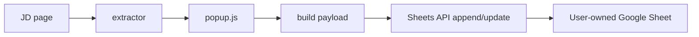

# Chrome Extension v2 Spec

## 1. Purpose

This document defines the product direction and implementation plan for Chrome extension v2.

v1 proved that the core workflow works:

- open a JD page
- extract job information
- save it to a Google Sheet with `queue_status = saved`

v2 changes the goal from **self-usable MVP** to **shareable and publishable product**.

## 2. Product Goal

Build a Chrome extension that a non-programmer friend can install and use without deploying Apps Script.

The product promise becomes:

> Save the current job description page into your own Google Sheet in one click.

## 3. Core Product Decision

v2 will no longer require users to deploy their own Apps Script Web App.

Instead, v2 will use:

- Chrome extension
- Google OAuth
- Google Sheets API
- a public read-only Google Sheet template

The extension remains intentionally narrow:

- it reads the current JD page
- it saves a structured row to a user-owned Google Sheet

It still does **not** include:

- AI generation
- Telegram delivery
- polling jobs
- openclaw integration

Those remain outside the extension product boundary.

## 4. Why v2 Exists

v1 is good enough for personal use, but it is not a good public distribution model because it expects the user to:

- create a Google Sheet
- create an Apps Script project
- deploy a Web App
- copy a secret

That setup is too technical for a general user.

v2 reduces setup to:

1. open a template
2. make a copy to your own Google Drive
3. paste your Google Sheet URL into extension settings
4. connect your Google account
5. start saving JDs

## 5. v2 User Story

1. User installs the Chrome extension.
2. User opens the extension settings.
3. User clicks `Open Template`.
4. User makes a copy of the public read-only Google Sheet template.
5. User pastes the copied Google Sheet URL into the extension settings.
6. The extension parses and stores the `spreadsheetId`.
7. User clicks `Connect Google`.
8. User grants Google access.
9. User visits a JD page and clicks `Save JD`.
10. Extension writes one row to the user's own `JD 收錄池` worksheet.

## 6. Product Scope

### 6.1 v2 In Scope

- public template-based onboarding
- Google Sheet URL input
- locked settings state after saving
- change-flow for replacing the target sheet
- Google OAuth login
- direct write to Google Sheets API
- worksheet existence validation
- same extractor architecture as v1

### 6.2 v2 Out of Scope

- creating a complete career workflow platform
- managing interviews
- built-in AI features
- syncing to Notion, Telegram, or other tools
- browser-side automation of job applications

## 7. Onboarding Design

### 7.1 Template Strategy

The product will provide a single public read-only Google Sheet template.

User action:

- click the template link
- make a personal copy

Reason:

- ensures schema consistency
- avoids asking users to design their own sheet structure
- avoids extension complexity around file creation and copying

### 7.2 Why the User Copies Manually

v2 intentionally starts with manual copying rather than automatic file duplication because:

- it is easier to implement
- it reduces Google Drive complexity
- it keeps the onboarding understandable
- it lowers the risk of over-scoping permissions in the first public version

### 7.3 Settings Flow

Settings will contain:

- template link
- Google Sheet URL input
- connect Google button
- save settings button

After a valid Google Sheet URL is stored:

- the input becomes read-only
- the value remains visible
- a `Change` button appears

Pressing `Change`:

- unlocks the input
- allows a different Google Sheet URL
- clears the locked state after confirmation

## 8. Settings Data Model

The extension will store the following settings in `chrome.storage.sync`:

- `spreadsheetUrl`
- `spreadsheetId`
- `spreadsheetLocked`
- `hasGoogleAuth`
- `connectedGoogleEmail` if available

Optional future settings:

- `worksheetName`
- `defaultPriority`
- `debugMode`

## 9. Spreadsheet Assumptions

v2 still assumes the target spreadsheet contains the `JD 收錄池` worksheet with the agreed schema.

Reference:

- [jd-intake-sheet-schema.md](/Users/vanessa/develop/job-application-automation/docs/jd-intake-sheet-schema.md)

If the user copies the official template, the structure should already be correct.

The extension should still validate:

- the spreadsheet exists
- the worksheet `JD 收錄池` exists
- the header row is compatible enough for writing

## 10. OAuth and API Direction

### 10.1 Chosen Direction

v2 will use Google OAuth and the Google Sheets API instead of Apps Script.

The extension should authenticate through `chrome.identity`.

### 10.2 Important Scope Decision

Because the user will manually paste an existing Google Sheet URL, the simplest v2.1 approach is likely to require the Google Sheets scope that allows editing spreadsheets directly.

This is important because `drive.file` is attractive as a narrower scope, but it is designed around files the app creates or files the user opens with the app through supported flows such as a picker-like interaction.

Inference:

- If the product uses only manual URL pasting, `drive.file` may not be enough for reliable access to an arbitrary pasted spreadsheet copy.
- Therefore v2.1 should optimize for a simpler product flow first, even if the OAuth scope is broader than the ideal final state.

### 10.3 Scope Strategy

For v2.1:

- prioritize implementation simplicity and predictable user flow
- accept that OAuth verification may be more involved

For later v2.x:

- evaluate whether the product should move to a narrower Drive-based file selection flow
- consider Picker or app-managed file selection if minimizing scopes becomes more important

## 11. Write Flow

The payload shape written to the spreadsheet remains close to v1:

- `record_id`
- `saved_at`
- `queue_status = saved`
- `source_site`
- `job_url`
- `job_title`
- `company`
- `industry`
- `location`
- `salary_text`
- `jd_text`
- `fit_note`
- `priority`
- `last_updated_at`

## 12. URL Handling

When the user saves settings, the extension must:

1. validate that the pasted string is a Google Sheet URL
2. parse out the `spreadsheetId`
3. store both the original URL and the parsed ID
4. lock the field after save

If the URL is invalid:

- show a clear settings error
- do not save

## 13. Validation Rules

Before allowing normal use, the extension should validate:

- Google auth is available
- spreadsheet settings are present
- a valid `spreadsheetId` exists
- the required worksheet exists

On save from popup, the extension should continue validating that the page looks like a JD page:

- `job_url`
- `job_title`
- `company`
- `jd_text`

## 14. UX Design Notes

### 14.1 Settings UX

The settings page should feel like a setup checklist, not a developer dashboard.

Preferred section order:

1. `Open Template`
2. `Paste Your Google Sheet URL`
3. `Connect Google`
4. `Ready to Save JDs`

### 14.2 Locked Field UX

After saving:

- the Google Sheet URL field stays visible
- the input is disabled or read-only
- the user sees a `Change` button

This supports users who:

- start a new job search cycle
- want a fresh spreadsheet
- want to switch to another template copy later

### 14.3 Error UX

Settings page errors should be product-language messages, for example:

- `Please paste a valid Google Sheet URL.`
- `We could not access this spreadsheet.`
- `The worksheet JD 收錄池 was not found.`
- `Google authorization is required before saving JDs.`

## 15. Migration from v1

v2 will replace the current Apps Script-based write path.

This means:

- `webAppUrl` and `sharedSecret` are removed from settings
- settings storage shape changes
- popup save flow must call Google APIs directly

What stays the same:

- extension extractor architecture
- popup interaction model
- target worksheet schema
- product boundary

## 16. Impact on Chrome Web Store Readiness

v2 is better aligned with future publishing because:

- the product has a narrow, clear single purpose
- the user owns the destination spreadsheet
- the extension does not depend on the author's private infrastructure
- the setup flow becomes understandable to normal users

v2 still needs future publishing work:

- privacy disclosures
- OAuth consent configuration
- scope justification
- store listing copy and screenshots

## 17. Risks

### 17.1 OAuth Complexity

Replacing Apps Script removes deployment burden for the user, but adds OAuth design and consent screen work.

### 17.2 Scope Review

If v2.1 uses a broader Sheets-related scope for simplicity, later product hardening may be needed before public launch.

### 17.3 Template Drift

If the public template changes, the extension and docs must stay aligned with the current schema.

### 17.4 Existing User Copies

If users already made copies from an older template version, the extension may need compatibility checks or migration guidance.

## 18. Recommended Implementation Phases

### Phase 1: v2 Spec and Settings Redesign

- finalize settings UX
- finalize URL parsing rules
- lock OAuth direction

### Phase 2: Google Auth Integration

- connect `chrome.identity`
- store auth state
- test token retrieval

### Phase 3: Spreadsheet Validation

- validate pasted Google Sheet URL
- read target spreadsheet
- confirm `JD 收錄池` exists

### Phase 4: Replace Write Path

- remove Apps Script dependency in popup
- call Sheets API directly
- verify row writing works

### Phase 5: Public Readiness

- reduce confusing setup
- tighten UX copy
- prepare for publish review

## 19. Current Conclusion

v1 should now be treated as complete enough for self-use.

v2 should be treated as a new productization pass with this exact direction:

- public template
- manual template copy
- pasted Google Sheet URL
- locked settings field with change flow
- Google OAuth
- direct Google Sheets API write

This keeps the product simple, shareable, and aligned with the eventual goal of publishing a real Chrome extension for friends to use.

## 20. Reference Links

Official references used to shape this spec:

- Chrome identity API: [chrome.identity](https://developer.chrome.com/docs/extensions/reference/api/identity)
- Chrome Web Store privacy expectations: [CWS privacy fields](https://developer.chrome.com/docs/webstore/cws-dashboard-privacy)
- Chrome Web Store policy direction: [Unexpected behavior policy](https://developer.chrome.com/docs/webstore/program-policies/unexpected-behavior)
- Google Sheets API concepts: [Sheets API overview](https://developers.google.com/workspace/sheets/api/guides/concepts)
- Google Sheets API scopes: [Sheets API scopes](https://developers.google.com/workspace/sheets/api/scopes)
- Google Drive scope guidance: [Drive API scopes](https://developers.google.com/workspace/drive/api/guides/api-specific-auth)
