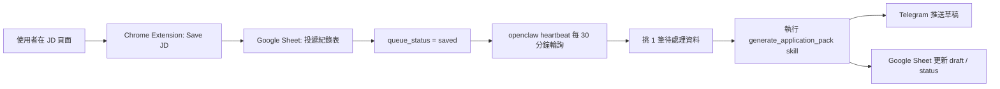
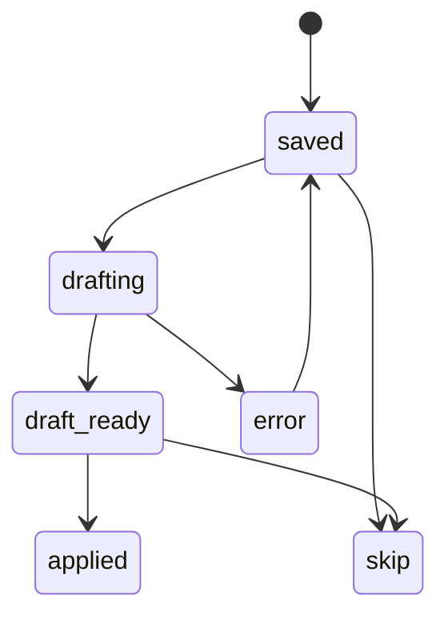

# 求職投遞自動化計劃書

## 1. 文件目的

這份文件用來固定目前已經討論完成的求職投遞自動化方案，讓後續即使換 session、換實作順序，仍然可以快速回到同一套上下文。

本計劃的核心目標不是再做一個爬蟲，而是把以下流程串起來：

1. 我在整理好的職缺列表中看到一筆有興趣的 JD。
2. 我點進去閱讀並判斷值得投遞。
3. 我按一下瀏覽器工具，把這筆 JD 收錄到自己的投遞紀錄系統。
4. 系統在背景排隊，定期挑一筆未處理職缺。
5. `openclaw` 根據我的公版自我推薦信與個人資料，自動產生針對這份 JD 的客製版草稿。
6. 草稿透過 Telegram 推送給我，供我人工審稿後正式投遞。

這份文件描述的不是單一功能，而是一整套協作流程，包含：

- Chrome Extension 的職責
- Google Sheet 的欄位與狀態設計
- `openclaw` 的輪詢與 AI 生成功能
- Telegram 推送設計
- 實作順序與風險控管

## 2. 問題定義

目前已經有一套爬蟲與 Google Sheet，可用來整理職缺資料，適合作為「AI 整理用職缺資料庫」。

但真實找工作時，還缺少一套「我決定要投這份工作之後」的個人投遞工作流：

- 缺一個低摩擦的收錄入口
- 缺一個把「想投這份」與「只是收藏看看」區分開來的資料結構
- 缺一個把 JD 與個人公版推薦信串給 AI 的穩定流程
- 缺一個可以背景排隊、逐筆產生推薦信的機制

因此，本計劃要解決的不是資料抓取，而是「從感興趣的 JD 到可送出的個人投遞素材」這段流程。

## 3. 設計原則

本方案採用以下設計原則：

### 3.1 優先降低操作摩擦

使用者的動作發生在 JD 頁面上，所以最自然的入口是 Chrome Extension，而不是桌面小工具、Google Sheets add-on 或 Raycast 主流程。

### 3.2 AI 只負責生成草稿，不負責自動投遞

AI 最適合插入在「收錄之後、正式投遞之前」這段，負責產出可審閱的草稿。最終送出仍保留人工決定權。

### 3.3 不把整套流程綁死在 Telegram UI 操作

不採用「自動打開 Telegram 視窗並幫忙貼訊息」作為主要方案，因為這種方法脆弱、難維護、依賴客戶端行為。Telegram 只作為結果通知與人工審稿入口。

### 3.4 extension 不直接承擔 AI 邏輯

AI prompt、技能選擇、文案策略應集中在 `openclaw` 端維護。Extension 只送結構化資料。

### 3.5 儘量避免暴露公開服務

為了降低安全風險，MVP 優先採用「Google Sheet 任務佇列 + `openclaw` 輪詢」架構，不要求開放公網 API。

## 4. 整體架構

### 4.1 MVP 架構



### 4.2 元件分工

#### Chrome Extension

負責：

- 讀取目前頁面的 JD 內容
- 讓使用者一鍵收錄
- 把資料寫進 Google Sheet

不負責：

- 呼叫 AI 模型
- 維護長 prompt
- 直接控制 Telegram 聊天視窗

#### Google Sheet

負責：

- 作為投遞紀錄主資料源
- 作為 AI 任務佇列
- 保存生成狀態與文案結果

#### openclaw

負責：

- 定期輪詢 Google Sheet
- 撿取待處理任務
- 執行「自我推薦信產生」技能
- 將結果推送到 Telegram
- 將草稿與狀態回寫 Google Sheet

#### Telegram

負責：

- 作為個人通知與草稿閱讀入口
- 接收 AI 產生結果
- 提供人工審稿起點

## 5. 為什麼選這個方案

### 5.1 為什麼主入口是 Chrome Extension

因為實際動作發生在瀏覽 JD 頁面時：

- 這時頁面內容、標題、網址都在眼前
- 使用者只需要一個低摩擦的按鈕
- Extension 可以最自然取得當前 tab 的內容

### 5.2 為什麼不優先做公開 bridge service

雖然 `Chrome Extension -> bridge service -> openclaw` 的即時流程體驗最好，但現階段有兩個缺點：

- 需要額外考慮 LAN API、安全、token、防火牆
- 需要 extension 與 `openclaw` 直接連線，增加初始整合複雜度

之後可以升級，但 MVP 先不用。

### 5.3 為什麼用 Google Sheet 當佇列

這符合目前已有工作流，且有幾個優點：

- 不必再引入新資料庫
- extension 已經需要寫 Sheet
- `openclaw` 只要定期掃描同一份表
- 容易人工觀察與除錯

## 6. 使用者流程

### 6.1 主要流程

1. 使用者在既有職缺列表或其他來源看到一筆有興趣的 JD。
2. 使用者點進職缺頁，人工閱讀。
3. 使用者確認值得投遞後，按下 Chrome Extension 的 `Save JD`。
4. Extension 解析目前頁面的基本資訊與主要文字內容，寫入投遞紀錄 Sheet。
5. 新資料列的 `queue_status` 被設為 `saved`。
6. `openclaw` 的 heartbeat 每 30 分鐘執行一次輪詢。
7. 每次輪詢只挑 1 筆 `queue_status = saved` 的資料，並先鎖成 `drafting`。
8. `openclaw` 套用 `generate_application_pack` 或 `generate_cover_letter` 技能。
9. `openclaw` 讀取固定候選人資料、公版推薦信與這份 JD，產出文案草稿。
10. 草稿送到 Telegram，同時回寫 Sheet。
11. `queue_status` 更新為 `draft_ready`。
12. 使用者在 Telegram 或 Google Sheet 中閱讀草稿，進一步手動修稿並正式投遞。

### 6.2 使用者操作最少化目標

MVP 的理想體驗是：使用者在 JD 頁面只做 1 次點擊。

如果未來要加入更多功能，可以再擴充為：

- `Save JD`
- `Save + Priority`
- `Skip`
- `Mark Applied`

但第一版應優先壓到最小。

## 7. 參考舊投遞表的結論

舊投遞紀錄表提供了有價值的真實欄位設計，代表過去找工作時實際有在追蹤的資訊。這些欄位不應被忽略。

舊表的核心欄位包括：

- `Overall Status`
- `職缺連結 Link`
- `職缺名稱 Position`
- `公司 Company`
- `產業 Industry`
- `投遞日期 Date`
- `投遞狀態`
- `關卡 1 類型`
- `關卡 1 日期`
- `關卡 2 類型`
- `關卡 2 日期`
- `關卡 3 類型`
- `關卡 3 日期`
- `Result 類型`
- `Result Receive Date`
- `Note`
- 多個 `決策條件` 欄位

但新方案不應直接照抄整張表，而應：

- 保留過去真的會手動追蹤的欄位
- 補上一組給自動化與 AI queue 用的欄位

## 8. Google Sheet 設計

### 8.1 推薦結構

建議同一份 Spreadsheet 內分成兩個工作表：

1. `JD 收錄池`
2. `投遞追蹤`

### 8.2 為什麼分成兩張工作表

#### `JD 收錄池`

用途：

- Extension 寫入原始收錄資料
- `openclaw` 掃描待處理任務
- 存放 AI 生成結果

這張表偏向機器流程。

#### `投遞追蹤`

用途：

- 保留過去習慣的人工追蹤欄位
- 記錄面試階段、結果、決策條件

這張表偏向使用者手動管理。

### 8.3 MVP 可接受的簡化方案

如果想先少做一點，也可以第一版只用一張表。但欄位要明確區分三區：

- 基本職缺資訊
- AI queue / 草稿資訊
- 投遞後追蹤資訊

### 8.4 `JD 收錄池` 建議欄位

以下是推薦欄位與維護責任。

| 欄位名稱 | 用途 | 寫入者 |
| --- | --- | --- |
| `record_id` | 唯一識別碼 | extension |
| `saved_at` | 收錄時間 | extension |
| `queue_status` | 任務狀態 | extension / openclaw |
| `source_site` | 來源站點，如 104、CakeResume | extension |
| `job_url` | 職缺網址 | extension |
| `job_title` | 職缺名稱 | extension |
| `company` | 公司名稱 | extension |
| `industry` | 產業，能抓就抓 | extension |
| `location` | 地點 | extension |
| `salary_text` | 薪資原文 | extension |
| `jd_text` | 主要職缺文字 | extension |
| `jd_summary` | AI 或後處理摘要 | openclaw |
| `source_list_ref` | 原始整理表中對應來源或標記 | extension / 手動 |
| `priority` | 使用者主觀優先度 | 手動 / extension 後續擴充 |
| `fit_note` | 使用者當下備註 | 手動 |
| `candidate_profile_id` | 使用哪一版個人資料 | openclaw |
| `base_letter_id` | 使用哪一版公版信 | openclaw |
| `skill_used` | 執行的 skill 名稱 | openclaw |
| `draft_started_at` | 開始生成草稿時間 | openclaw |
| `draft_generated_at` | 草稿完成時間 | openclaw |
| `cover_letter_short` | 短版推薦信 | openclaw |
| `cover_letter_full` | 完整版推薦信 | openclaw |
| `fit_reasons` | 3 點適配理由 | openclaw |
| `gap_notes` | 缺口提醒 | openclaw |
| `telegram_sent_at` | 推送 Telegram 時間 | openclaw |
| `telegram_message_ref` | Telegram 訊息識別資訊 | openclaw |
| `error_message` | 失敗原因 | openclaw |
| `last_updated_at` | 最後更新時間 | extension / openclaw |

### 8.5 `投遞追蹤` 建議欄位

保留過往使用習慣，並與新系統保持可對照：

| 欄位名稱 | 用途 |
| --- | --- |
| `Overall Status` | 總體狀態，如已投遞、面試中、已結束 |
| `職缺連結` | 職缺網址 |
| `職缺名稱` | 職稱 |
| `公司` | 公司名稱 |
| `產業` | 產業 |
| `投遞日期` | 真正投遞日期 |
| `投遞狀態` | 例如公司未讀取、收到下一步邀請、拒絕信 |
| `關卡 1 類型` | 第一關形式 |
| `關卡 1 日期` | 第一關日期 |
| `關卡 2 類型` | 第二關形式 |
| `關卡 2 日期` | 第二關日期 |
| `關卡 3 類型` | 第三關形式 |
| `關卡 3 日期` | 第三關日期 |
| `Result 類型` | 最終結果 |
| `Result Receive Date` | 收到結果日期 |
| `Note` | 備註 |
| `決策條件：學習支持` | 決策參考 |
| `決策條件：薪資` | 決策參考 |
| `決策條件：onboard 時間` | 決策參考 |
| `決策條件：Mentor` | 決策參考 |

### 8.6 兩張表的關聯方式

建議用 `record_id` 來關聯。

若後續要自動將 `JD 收錄池` 某筆資料同步到 `投遞追蹤`，就以 `record_id` 為主鍵，不要只靠網址。

## 9. 狀態機設計

### 9.1 queue 狀態欄位

`queue_status` 建議值如下：

- `saved`
- `drafting`
- `draft_ready`
- `applied`
- `skip`
- `error`

### 9.2 狀態意義

#### `saved`

代表：

- 已由 extension 收錄
- 使用者判斷值得投遞
- 尚未開始 AI 草稿生成

#### `drafting`

代表：

- `openclaw` 已撿到這筆任務
- 正在處理中
- 不應被其他輪詢重複撿走

#### `draft_ready`

代表：

- 草稿已成功生成
- Telegram 已推送或待使用者查看

#### `applied`

代表：

- 使用者已正式投遞

#### `skip`

代表：

- 後來決定不投遞，保留紀錄但不再處理

#### `error`

代表：

- 處理失敗，需要手動查看或重試

### 9.3 狀態轉移



### 9.4 為什麼一定要有 `drafting`

若只使用 `saved` 與 `draft_ready`，當 heartbeat 重跑或任務中途延遲時，可能造成同一筆職缺被重複生成多次。因此一旦撿單，必須先原子性地轉成 `drafting`。

## 10. Chrome Extension 規格

### 10.1 功能目標

第一版 Extension 只做一件事：

- 在使用者瀏覽 JD 頁面時，按一下即可收錄到 `JD 收錄池`

### 10.2 第一版不做的事

以下不列入 MVP：

- 直接呼叫 AI
- 直接打 Telegram 對話框
- 自動送出求職申請
- 建複雜設定頁

### 10.3 建議 UI

MVP 可以是瀏覽器 toolbar popup：

- 顯示目前頁面 URL
- 顯示自動抓到的職缺名稱、公司名稱
- 一個主要按鈕：`Save JD`
- 選填欄位：`fit_note`

未來可擴充：

- `priority`
- `skip`
- `open sheet`

### 10.4 Extension 需要抓的資料

至少包含：

- `job_url`
- `job_title`
- `company`
- `source_site`
- `jd_text`
- `saved_at`

次要可選：

- `industry`
- `location`
- `salary_text`

### 10.5 資料抓取策略

第一版不要過度追求每個站點都精準解析，可採分層策略：

1. 優先用常見 selector 擷取
2. 若無法對應，退回頁面標題與主要文字內容
3. 抓不到的欄位留空，由人工或後續流程補

原則是先讓流程穩定，再逐站微調 selector。

### 10.6 Extension 與 Google Sheet 的整合方式

第一版可透過 Google Apps Script Web App 寫入 Sheet。

流程：

1. Extension 組好 payload
2. `POST` 到 Apps Script Web App
3. Apps Script 驗證請求並寫入指定表格
4. 回傳成功結果與 `record_id`

### 10.7 Extension payload 建議格式

```json
{
  "record_id": "uuid",
  "saved_at": "2026-03-26T18:00:00+08:00",
  "queue_status": "saved",
  "source_site": "cakeresume",
  "job_url": "https://...",
  "job_title": "Frontend Engineer",
  "company": "Example Co",
  "industry": "",
  "location": "Taipei",
  "salary_text": "",
  "jd_text": "完整或截斷後的 JD 文字",
  "fit_note": ""
}
```

### 10.8 去重策略

MVP 先用 `job_url` 為主去重，必要時再輔以 `company + job_title`。

Apps Script 寫入前應檢查是否已存在相同 `job_url`：

- 若存在，可回傳 `duplicate`
- 若不存在，則新增資料列

## 11. Google Apps Script 寫入層

### 11.1 角色

Apps Script 作為 Extension 與 Google Sheet 之間的薄寫入層。

它的責任應保持簡單：

- 接收 Extension 的 `POST`
- 檢查必要欄位
- 檢查重複資料
- 寫入對應欄位
- 回傳新增結果

### 11.2 不要在 Apps Script 做太多邏輯

不建議把以下複雜邏輯堆進 Apps Script：

- AI prompt 組裝
- 大量文字分析
- Telegram 推送
- 推薦信生成

這些都應留給 `openclaw`。

### 11.3 寫入成功後的回傳

建議回傳：

```json
{
  "ok": true,
  "record_id": "uuid",
  "row_number": 42,
  "status": "created"
}
```

若是重複資料：

```json
{
  "ok": true,
  "record_id": "existing-id",
  "row_number": 42,
  "status": "duplicate"
}
```

## 12. openclaw 自動輪詢設計

### 12.1 核心概念

`openclaw` 不需要被 Extension 主動呼叫。改由 heartbeat 定期掃描 `JD 收錄池`，看有沒有待處理資料。

### 12.2 掃描頻率

目前共識為：

- 每 30 分鐘掃描一次

這個節奏的好處：

- 不會太密集，降低 token 與通知壓力
- 對個人求職流程來說足夠
- 容易併入現有 heartbeat 工作

### 12.3 每次只處理一筆

這是重要限制：

- 每輪只撿一筆 `saved`
- 優先撿最早收錄的一筆

原因：

- Telegram 不會一次被洗版
- 更容易監控錯誤
- 有利於你逐份審稿

### 12.4 撿單規則

建議查詢條件：

- `queue_status = saved`
- 依 `saved_at ASC`
- 取第一筆

### 12.5 鎖定流程

撿到資料後，第一步不是直接生成，而是：

1. 將該筆 `queue_status` 改為 `drafting`
2. 記錄 `draft_started_at`
3. 再開始 AI 任務

這樣可避免重複處理。

### 12.6 完成後更新

成功時更新：

- `queue_status = draft_ready`
- `draft_generated_at`
- `cover_letter_short`
- `cover_letter_full`
- `fit_reasons`
- `gap_notes`
- `telegram_sent_at`
- `skill_used`

失敗時更新：

- `queue_status = error`
- `error_message`

### 12.7 重試策略

MVP 可先用手動重試：

- 人工把 `queue_status` 從 `error` 改回 `saved`

之後才考慮自動重試次數欄位，例如：

- `retry_count`
- `last_error_at`

## 13. openclaw Skill 設計

### 13.1 為什麼要用 skill

長 prompt 不應由 Extension 每次傳送，應集中在 `openclaw` 端，以 skill 形式管理。

好處：

- prompt 可統一維護
- 調整規則不需改 Extension
- 可以逐步進化成多種輸出模板

### 13.2 建議 skill 名稱

第一版建議不要只叫 `generate_cover_letter`，而是命名為：

- `generate_application_pack`

因為實際使用時，通常不只需要一封推薦信，而是一組投遞素材。

### 13.3 skill 輸入

```json
{
  "record_id": "uuid",
  "job": {
    "job_url": "https://...",
    "job_title": "Frontend Engineer",
    "company": "Example Co",
    "jd_text": "..."
  },
  "candidate_profile_id": "default",
  "base_letter_id": "general_v1"
}
```

### 13.4 skill 依賴的固定資產

`openclaw` 端應維護以下固定資料：

- `candidate_profile`
- `base_cover_letter`
- `generation_constraints`

#### `candidate_profile`

內容包含：

- 真實背景
- 工作經驗
- 技術能力
- 想找的職缺方向
- 不可誇大的邊界

#### `base_cover_letter`

內容為公版自我推薦信。

#### `generation_constraints`

至少包含：

- 不可捏造經驗
- 不符合 JD 的能力不要硬強調
- 優先沿用 JD 用詞
- 語氣自然，不過度浮誇
- 可依投遞場景限制字數

### 13.5 skill 輸出

建議輸出四塊內容：

1. `cover_letter_short`
2. `cover_letter_full`
3. `fit_reasons`
4. `gap_notes`

#### `cover_letter_short`

用途：

- 適合短欄位自介
- 長度建議 120 到 250 字

#### `cover_letter_full`

用途：

- 適合完整自我推薦信或 cover letter

#### `fit_reasons`

用途：

- 給你快速判斷 AI 覺得自己適合的三個面向
- 也可作為後續面試準備

#### `gap_notes`

用途：

- 提醒這份 JD 可能的弱點或待補資訊

### 13.6 生成原則

skill 應遵守以下原則：

- 僅使用真實資訊
- 不創造不存在的技能或成就
- 盡量將已具備能力映射到 JD 用語
- 不符合需求的能力不主動突出
- 優先提高可投遞性，而非追求花俏文案

## 14. Telegram 推送設計

### 14.1 推送內容

每次成功處理一筆後，推送給你的內容建議包含：

- 公司名稱
- 職缺名稱
- JD 連結
- 短版推薦信
- 完整版推薦信
- 3 點適配理由
- 缺口提醒
- `record_id` 或表格對應資訊

### 14.2 推送格式

重點是易讀、可快速複製，不需要太花。

例如：

```text
[Application Draft]
公司：Example Co
職缺：Frontend Engineer
連結：https://...

短版推薦：
...

完整版推薦信：
...

適配理由：
1. ...
2. ...
3. ...

提醒：
...

record_id: ...
```

### 14.3 為什麼 Telegram 只當通知層

這樣做的好處：

- 避免綁死在 Telegram deep link 或輸入框控制
- 即使之後改成 Email、Notion 或其他通知入口，核心流程仍不變

## 15. 資料同步策略

### 15.1 `JD 收錄池` 是否保存完整 JD 文字

建議第一版就保存 `jd_text`。

原因：

- 避免之後職缺頁面下架或變更
- 避免 `openclaw` 需要重新抓取網頁
- 可以提升 AI 生成的穩定性

### 15.2 `投遞追蹤` 是否自動同步

MVP 可先不做自動同步，由使用者在真正投遞後手動更新或複製。

第二階段再考慮：

- 當 `queue_status = applied` 時，將欄位同步到 `投遞追蹤`

## 16. 安全與權限設計

### 16.1 MVP 優先方案的安全特性

`openclaw` 不需要暴露公開 API，因此：

- 沒有公網入口
- 不需額外配置公開 bridge service
- 安全面較小

### 16.2 Apps Script 安全考量

需要至少處理：

- 請求來源驗證
- 簡單 token 或共享密鑰
- 避免匿名濫寫

### 16.3 後續若改成 LAN bridge service

若未來為了縮短延遲而改成內網服務，可採：

- 僅綁定內網 IP
- 不做 port forwarding
- 防火牆限制來源裝置
- 加 bearer token
- 加 timestamp / signature

但這是後續升級方案，不列入 MVP 必做。

## 17. 實作階段規劃

### Phase 1: 基礎資料流

目標：

- Extension 能把 JD 寫進 `JD 收錄池`

交付：

- Google Sheet 新表設計完成
- Apps Script Web App 可寫入
- Extension `Save JD` 可正常新增一筆資料
- 去重邏輯可用

### Phase 2: openclaw 輪詢與產生草稿

目標：

- heartbeat 可定期掃描 `saved`
- 每次只處理一筆

交付：

- `openclaw` 輪詢任務
- `drafting` 鎖定機制
- `generate_application_pack` skill
- Telegram 推送
- 回寫草稿與狀態

### Phase 3: 使用體驗修正

目標：

- 提高抓取品質與文案品質

交付：

- 針對常用求職站補 selector
- 改善 prompt 資產
- 增加錯誤紀錄與重試策略

### Phase 4: 進階整合

可選：

- `draft_ready -> applied` 的同步流程
- 內網 bridge service
- 直接在 Extension 顯示「已收錄」或「已生成」
- 多模板推薦信

## 18. 驗收標準

這套系統至少要滿足以下條件，才算 MVP 完成：

1. 在 JD 頁面按一次 `Save JD`，可於 Google Sheet 中新增一筆正確資料。
2. 新增資料的 `queue_status` 為 `saved`。
3. `openclaw` heartbeat 可在輪詢時正確撿出最早的一筆 `saved`。
4. `openclaw` 處理前會先將狀態更新為 `drafting`。
5. 生成成功後會推送 Telegram 並回寫草稿到 Sheet。
6. 生成成功後狀態會更新為 `draft_ready`。
7. 若生成失敗，狀態會改為 `error` 且留下錯誤訊息。

## 19. 風險與注意事項

### 19.1 JD 解析不穩

不同求職網站 DOM 差異很大，因此第一版要接受：

- 先抓到足夠可用，而非完美
- 缺值允許人工補

### 19.2 草稿長度與品質可能需數次調整

這取決於：

- 公版推薦信品質
- 候選人背景資料結構
- skill prompt 寫法

因此 prompt 資產要視為可迭代內容。

### 19.3 Sheet 儲存長文字的可讀性

如果 `jd_text` 與 `cover_letter_full` 都存進同一張表，表會變得很寬很重。這是可以接受的 MVP 取捨，但後續可能需要：

- 只在 `JD 收錄池` 保存長文字
- `投遞追蹤` 只保留精簡欄位

### 19.4 不建議一開始就做太多互動功能

例如：

- 多按鈕狀態
- 自動同步雙表
- 自動判斷是否要生成

這些都可能拖慢 MVP 落地。

## 20. 後續待定事項

以下事項尚未最終定案，但不影響先做 MVP：

- `JD 收錄池` 是否與 `投遞追蹤` 拆成兩張表，或先單表上線
- `fit_note` 是否要在 Extension popup 中提供輸入框
- `priority` 是否列入第一版
- `candidate_profile` 與 `base_cover_letter` 的檔案格式與儲存位置
- Telegram 推送後，是否要在訊息中附上可快速標記 `applied` 的回傳控制

## 21. 建議的下一步

後續實作順序建議如下：

1. 先定 Sheet 欄位，尤其是 `JD 收錄池`
2. 寫 Apps Script Web App，完成基本新增與去重
3. 做 Chrome Extension 的 `Save JD`
4. 準備 `openclaw` 的固定資產：
   - `candidate_profile`
   - `base_cover_letter`
   - `generation_constraints`
5. 寫 `openclaw` heartbeat 輪詢與狀態更新流程
6. 寫 `generate_application_pack` skill
7. 串 Telegram 推送
8. 跑一輪端到端測試

## 22. 本計劃的最終定義

這個自動化系統的目標不是把投遞全自動化，而是把「看完 JD 後決定值得投」到「拿到一版可審閱的客製推薦信」這段流程半自動化。

其中：

- Chrome Extension 負責低摩擦收錄
- Google Sheet 負責資料中心與任務佇列
- `openclaw` 負責 AI 生成與輪詢調度
- Telegram 負責通知與草稿閱讀

這是目前最符合實際使用情境、最容易先落地、也最容易逐步擴充的方案。
